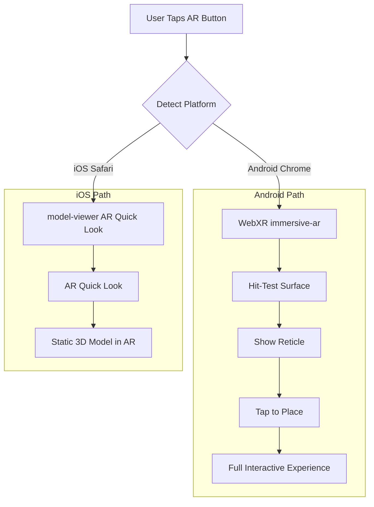

# Cross-Platform AR Implementation for Toki Highball

## Platform Strategy

## Cross-Platform Approach

| Platform | Technology | Features | Limitations |

|----------|------------|----------|-------------|

| **Android** | WebXR | Full experience: surface detection, placement, animations, hotspots | None |

| **iOS** | `<model-viewer>` + Quick Look | Native AR placement via USDZ | No animations/interactivity in AR |

### Why `<model-viewer>`?

Google's `<model-viewer>` web component provides best cross-platform AR:

- **Android**: Uses WebXR Scene Viewer
- **iOS**: Automatically triggers AR Quick Look with USDZ
- Single code path with graceful degradation

## Key Implementation Steps

### 1. Scene Setup Changes (`scene-setup.js`)

- Enable `renderer.xr.enabled = true`  
- Set `alpha: true` for camera passthrough
- Conditionally hide `scene.background` in AR mode

### 2. WebXR AR Module (`ar-system.js`) - Android

- AR session with `hit-test`, `dom-overlay` features
- Reticle mesh for surface indication
- Tap-to-place anchoring logic

### 3. iOS Fallback Strategy

- Use `<model-viewer>` component with `ar` attribute
- Pre-export USDZ of drink (static snapshot)
- Show "View in AR" that triggers Quick Look on iOS

### 4. Drink Group Refactor

Group all elements under single `THREE.Group` for unified transforms:

- Glass, liquid, ice, bubbles, orbiting elements

## Files to Create/Modify

| File | Action | Purpose |

|------|--------|---------|

| `ar-system.js` | Create | WebXR hit-test, reticle, placement (Android) |

| `scene-setup.js` | Modify | XR-enabled renderer, alpha background |

| `main.js` | Modify | AR integration, drink group hierarchy |

| `proto-toki.html` | Modify | model-viewer fallback, AR button styling |

| `models/toki-drink.glb` | Create | Static export for model-viewer |

## Trade-off Note

iOS users get a simplified AR experience (static model placement) while Android users get the full interactive experience. This is the reality of iOS Safari's WebXR limitations.